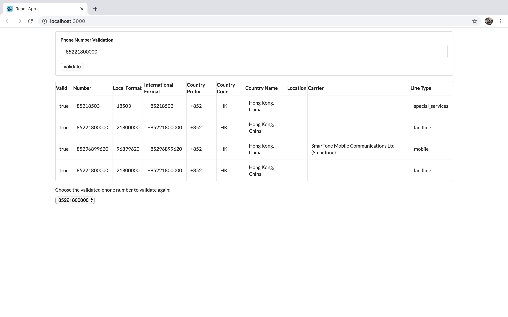

### Configuration

the access_key for numverify is configurable in config/properties.js 

### Assumption 

Any non phone number invalid input (such as empty string, characters etc)  will not yield result thus not shown in result table
This is just a very quick app to validate phone number so it should be ok. This has to be fine tune when it comes to production grade application

Recent Chrome version is used for testing

### Running the server locally

    npm install
    npm start

Then the application should be displayed and available for use as follows:

